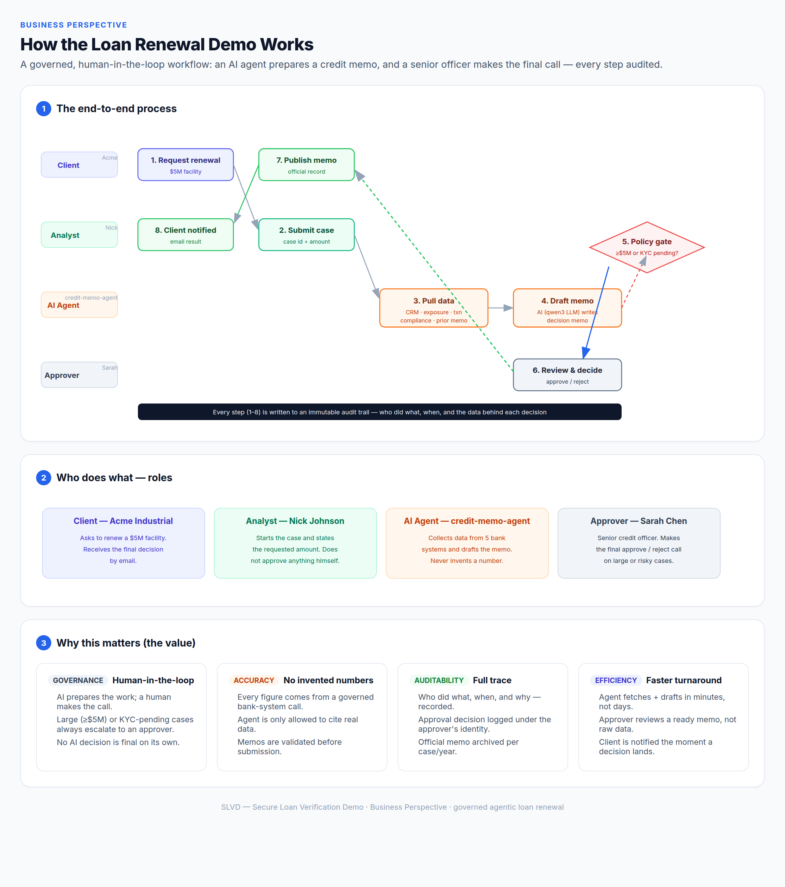
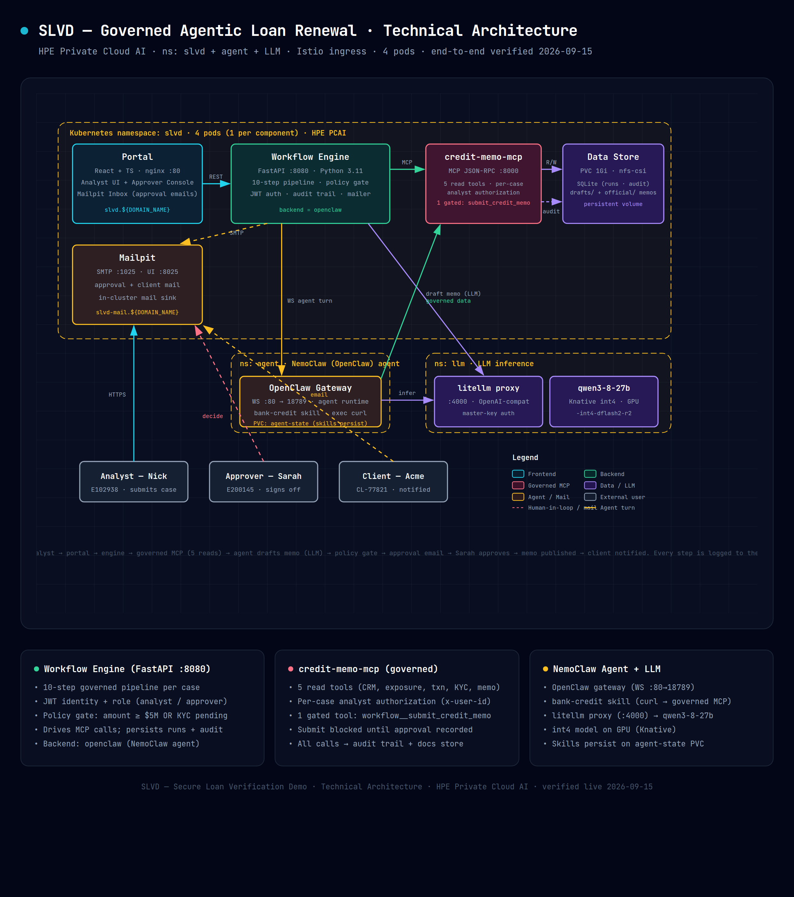

# SLVD — Secure Loan Verification Demo

A **governed, human-in-the-loop AI workflow** for loan renewal. An AI agent gathers
credit data from the bank's back-office systems and drafts a decision memo; a senior
credit officer makes the final call on large or risky cases. Every step is audited.

> **The story in one line:** the AI does the analyst's research work in minutes, but a
> human always holds the approval pen — and every action is on the record.

---

## Two ways to read this document

- **Business readers**: start with [How it works (business view)](#how-it-works-business-view),
  then [Who does what](#who-does-what), then [Why it matters](#why-it-matters).
- **Technical readers**: jump to [Architecture](#architecture) and
  [Deployment](#deployment-on-hpe-private-cloud-ai).

Both diagrams below are interactive HTML + static PNG:

| Diagram | Static | Interactive |
|---|---|---|
| Business perspective | [`images/slvd-business-perspective.png`](images/slvd-business-perspective.png) | [`images/slvd-business-perspective.html`](images/slvd-business-perspective.html) |
| Technical architecture | [`images/slvd-technical-architecture.png`](images/slvd-technical-architecture.png) | [`images/slvd-technical-architecture.html`](images/slvd-technical-architecture.html) |

---

## How it works (business view)

A client (Acme Industrial) asks to renew a **$5M** revolving facility. The bank's
analyst (Nick) starts the case. From there:

1. **Client requests** a renewal of the facility.
2. **Analyst submits** the case id and the requested amount.
3. **AI agent pulls data** from five bank systems — CRM profile, credit exposure,
   transaction behavior, compliance (KYC/sanctions), and the prior memo.
4. **AI drafts the memo** — a professional credit decision memo (recommendation + conditions).
5. **Policy gate** — if the amount is **≥ $5M** *or* KYC is **pending**, the case is escalated
   to a senior approver. (Smaller, clean cases can auto-complete.)
6. **Approver reviews & decides** — Sarah Chen, senior credit officer, approves or rejects
   from a governance console (or by clicking the link in her approval email).
7. **Memo is published** to the official credit record.
8. **Client is notified** by email with the outcome.



### Who does what

| Role | Who | What they do | What they do **not** do |
|---|---|---|---|
| **Client** | Acme Industrial (CL-77821) | Requests the renewal; receives the decision by email | — |
| **Analyst** | Nick Johnson (E102938) | Starts the case, states the amount | Never approves anything |
| **AI Agent** | credit-memo-agent | Collects data from 5 systems, drafts the memo | Never invents a number; never makes the final call |
| **Approver** | Sarah Chen (E200145) | Makes the final approve/reject decision on large/risky cases | — |

### Why it matters

- **Governance** — AI prepares the work; a human makes the call. No AI decision is final
  on its own.
- **Accuracy** — every figure comes from a governed bank-system call. The agent is only
  allowed to cite real data; memos are validated before submission.
- **Auditability** — who did what, when, and why is recorded. The approval is logged under
  the approver's identity. The official memo is archived per case/year.
- **Efficiency** — the agent fetches and drafts in minutes, not days. The approver reviews a
  ready memo, not raw data. The client is notified the moment a decision lands.

---

## Architecture

### Technical overview

The system runs on **HPE Private Cloud AI (PCAI)** as pods in a dedicated Kubernetes
namespace (`slvd`), with the AI agent and the LLM as separate in-cluster services whose
endpoints are configured via chart values.



**Core components:**

| Component | Tech | Port | Responsibility |
|---|---|---|---|
| **Portal** | React + TS (nginx) | 80 | Analyst UI, approver console, mail inbox |
| **Workflow Engine** | FastAPI (Python 3.11) | 8080 | The governed pipeline, policy gate, JWT auth, audit, mailer |
| **credit-memo-mcp** | MCP server (JSON-RPC) | 8000 | Governed data tools + the gated submit tool |
| **Data Store** | SQLite + files on PVC | — | Runs, audit trail, draft/official memos |
| **Mailpit** | SMTP + UI | 1025 / 8025 | Approval + client email (in-cluster sink) |

**AI layer:**

| Component | Responsibility |
|---|---|
| **OpenClaw agent** (NemoClaw) | The generative step — pulls data via the `bank-credit` skill and drafts the memo |
| **litellm proxy** → **qwen3-8-27b** | LLM inference (int4 on GPU) |

### Why both a FastAPI engine *and* an OpenClaw agent?

They are deliberately separated because an LLM agent is **not** a trustworthy system of record:

- **FastAPI = the bank's compliance system.** It is deterministic and unit-testable. It owns
  state, identity (analyst vs. approver JWT), the **policy gate** (`amount ≥ $5M OR KYC
  pending`), the **gated submit** (the memo cannot be published until an approval is recorded),
  the **audit trail**, and all human integration (portal, console, emails, official archive).
- **OpenClaw = the analyst's brain.** It is the visible "agentic" step — it reasons over the
  collected data and writes the memo. It is a *pluggable backend* for the drafting step
  (`SLVD_AGENT_BACKEND = openclaw | direct_llm | stub`); swap it and the entire governance
  layer is unchanged.
- **The agent cannot bypass control.** The submit tool is gated *server-side* in the MCP, and
  the agent's draft is *validated* (format + required values) before it proceeds. So no matter
  what the model wants to do, the memo only publishes after a human approval is recorded.

The demo's core point: **governed, human-in-the-loop AI** — the AI prepares the work, the
deterministic engine enforces policy, the human makes the call.

### The governed MCP tools

| Order | Tool | Returns | Access |
|---:|---|---|---|
| 1 | `get_crm_profile` | client profile, industry, BO status | read, per-case auth |
| 2 | `get_credit_exposure` | facility, limit, utilization, risk rating | read, per-case auth |
| 3 | `get_transactions` | transaction / cash-flow behavior | read, per-case auth |
| 4 | `get_compliance_status` | KYC status, sanctions | read, per-case auth |
| 5 | `get_prior_memo` | prior conditions, open follow-ups | read, per-case auth |
| 6 | `workflow__submit_credit_memo` | submits the memo into the workflow | **gated — needs approval** |

The agent calls all five read tools (safe), drafts the memo, then calls the gated submit.

> **Model note — llama3.1-8b is NOT supported in this demo (validated).** The agent runs on
> **`qwen3-8-27b-int4-dflash2-r2`**. We validated `llama3.1-8b` and it is **not usable here**:
> its output does not fit the **accepted schema in OpenClaw** (the response/structure OpenClaw
> expects for agent turns), so the agent loop breaks. Use the validated qwen3 model.

---

## Repository layout

```
secure_loan_verification_demo/
├── source_code/         # all demo code
│   ├── engine/          # FastAPI workflow engine (pipeline, policy, audit, mailer, API)
│   │   ├── api.py       # REST endpoints (runs, approvals, audit, memo)
│   │   ├── workflow.py  # the 10-step governed pipeline
│   │   ├── policy.py    # amount >= $5M OR KYC pending rule
│   │   ├── mcp / agent / mailer / store / security / memo
│   │   └── tests/       # unit tests
│   ├── mcp-server/      # credit-memo-mcp (governed data tools + gated submit)
│   ├── portal/          # React + TS frontend (analyst UI, approver console, mail)
│   ├── skills/          # bank-credit skill (agent → governed MCP)
│   ├── e2e/             # 8-scenario end-to-end suite + cluster verify + demo-run
│   ├── orchestrate/     # autonomous build/test/deploy loop (gates, loop)
│   ├── mockdata/        # the five bank-system fixtures (CRM, credit, txn, compliance, memo)
│   ├── Makefile         # entry point: test / build / deploy / verify / clean
│   ├── requirements.txt # python deps (installed into the root venv/)
│   ├── Dockerfile       # engine + credit-memo-mcp shared image (context = repo root)
│   ├── Dockerfile.portal# portal (Vite build + nginx)
│   └── conftest.py      # pytest package resolution
├── charts/
│   ├── slvd/            # SLVD Helm chart + EzAppConfig (PCAI BYOA deploy)
│   └── nemoclaw/        # NemoClaw (OpenClaw agent) Helm chart — deployed first (prereq)
├── slvd-0.9.9.tgz       # packaged SLVD helm chart (at repo root)
├── nemoclaw-0.4.7.tgz   # packaged NemoClaw helm chart (at repo root)
├── nemoclaw-icon.png    # NemoClaw chart icon (UI app tile logo)
└── images/              # screenshots + architecture/business diagrams (html + png)
```

---

## Deployment (HPE Private Cloud AI)

The demo is deployed by **importing the framework through the PCAI platform UI**
(BYOA import) — no CLI `kubectl apply` of the EzAppConfig. The UI does the install:
it pulls the chart from chartmuseum and applies the values you enter in the form.

### Prerequisite — import the NemoClaw (agent) chart first

The SLVD engine drives the agent through the **NemoClaw / OpenClaw gateway**, so the
NemoClaw chart must be deployed **before** the SLVD chart (the engine connects to it via
`SLVD_OPENCLAW_URL`). It is shipped in this repo:

- Chart source: `charts/nemoclaw/` (Helm chart, icon at `nemoclaw/icon.png`)
- Packaged: `nemoclaw-0.4.7.tgz` (repo root)
- Icon: `nemoclaw-icon.png` (repo root — used as the UI app-tile logo)

Push it to chartmuseum, then in the PCAI UI: Frameworks → *Import framework* (BYOA) →
select the `nemoclaw` chart → fill in values (`ezua.domainName`/`${DOMAIN_NAME}`, the
inference endpoint `inference.endpoint` + `inference.model`, `gateway.token`) → *Deploy*.
This creates the `nemoclaw` namespace + the OpenClaw gateway service that SLVD targets.

### Deploy the SLVD chart

1. **Publish the artifacts** (one-off, from a dev machine):

   ```bash
   make -f source_code/Makefile build-images   # build + push engine/mcp + portal images to the registry
   make -f source_code/Makefile chart          # helm lint + package + push the chart to chartmuseum
   ```

2. **Import in the PCAI UI**: Frameworks → *Import framework* (BYOA) → select the
   `slvd` chart version from chartmuseum → fill in the values:
   - image tag (from step 1) and `${DOMAIN_NAME}` for the ingress host
   - the `secrets` block: `litellmApiKey`, `jwtSecret`, `hmacSecret`, `openclawToken`
   - agent/LLM endpoints: `SLVD_OPENCLAW_URL` (NemoClaw gateway service, deployed in the
     prerequisite above) and `SLVD_LLM_BASE_URL` + `SLVD_LLM_MODEL` (litellm proxy)

   → *Deploy*. The platform creates the namespace and the release.

3. **Post-deploy checks** (optional, from a dev machine):

   ```bash
   make -f source_code/Makefile verify         # external URL + agent + LLM health checks
   make -f source_code/Makefile demo-run       # one fresh end-to-end run via the portal API
   ```

> **Make note:** the only Makefile lives at `source_code/Makefile` (there is no root
> wrapper anymore). Run it as `make -f source_code/Makefile <target>`, or `cd source_code`
> first and use plain `make <target>`. All targets already resolve paths relative to
> the repo root, so they work from either location.

- **External URLs**: an Istio VirtualService on the platform ingress gateway
  (`istio-system/ezaf-gateway`) exposes
  - Portal: `https://slvd.${DOMAIN_NAME}`
  - Mail:   `https://slvd-mail.${DOMAIN_NAME}`
- **Pods**: exactly 4 (1 per component) — portal, engine, credit-memo-mcp, mailpit.
- **Agent backend**: `SLVD_AGENT_BACKEND=openclaw` → the NemoClaw gateway service.
- **LLM**: `SLVD_LLM_MODEL` via the litellm proxy at `SLVD_LLM_BASE_URL`.

### Default users (demo)

| Role | Username | Password |
|---|---|---|
| Analyst | `nick` | `analyst123` |
| Approver | `sarah` | `officer123` |

---

## Verification

The demo is validated by a real run, not by reading the code:

- **Live**: a real run through the openclaw agent → governed MCP → approval gate →
  approver decision → published memo → client email, with every step in the audit trail.

## License

Internal demo.
